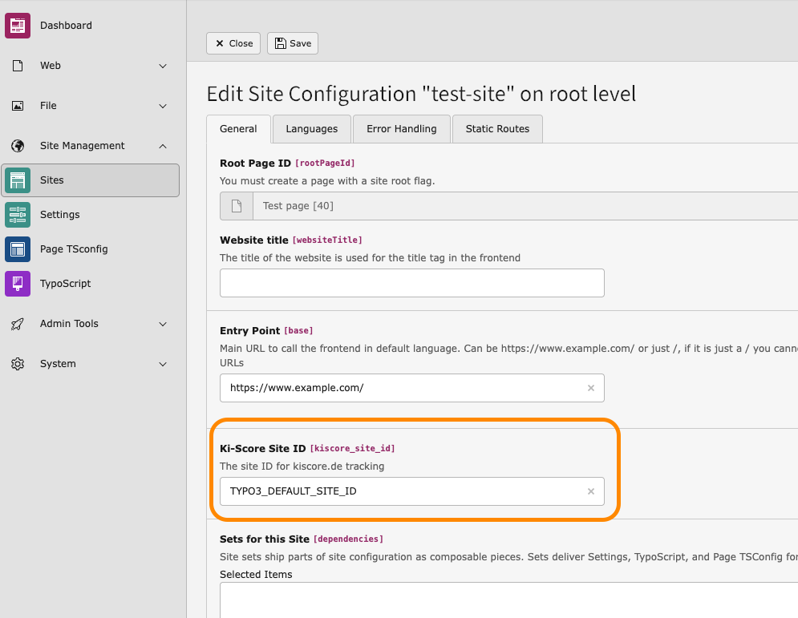

# Ki-Score TYPO3 extension

TYPO3 extension to integrate kiscore.ai, AI bot detection and analysis.

## Installation

```bash
composer require tpwd/typo3-kiscore
```

## Configuration

The extension automatically tracks all frontend requests and sends the data to kiscore.de.

### Site ID

By default, the extension uses a test site ID. To use your own site ID:

1. Go to the TYPO3 Site Configuration module
2. Edit your site configuration
3. Enter your Ki-Score Site ID in the corresponding field
4. Save the configuration

## Features

- Tracks all frontend requests (including cached pages)
- Sends user agent, referer, and URL information to kiscore.de
- Compatible with TYPO3 12 and 13
- Minimal performance impact (tracking happens after the response is sent)

## Example


